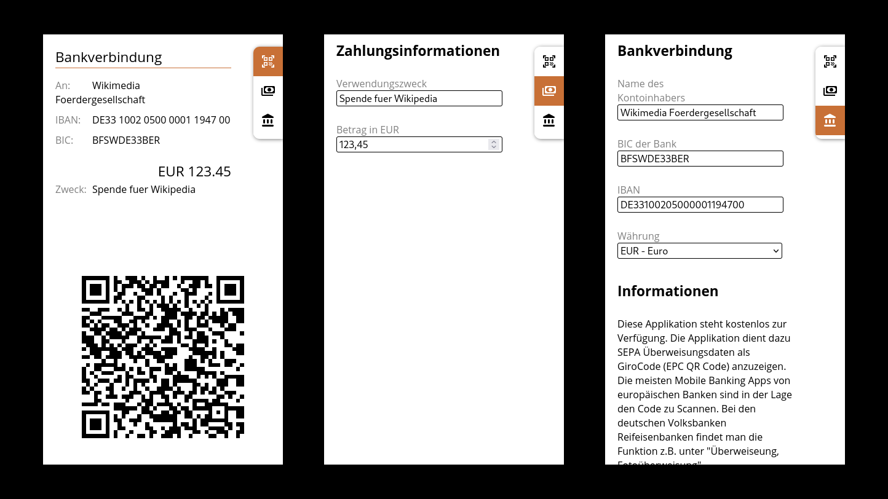

# Bankverbindung

## Englisch description

An offline web application for mobile phones. It stores your bank account information (in German: Banverbindung) and displays it as an EPC QR-Code (aka. Girocode).

If some one who has an Europeen mobile baking app wants to send you money, they can do so easily by scanning the code with their banking app. Doing so fills in the transaction form (in German: Überweisungsformular) without typing and without typos.

If you want to use this application without hosting it yourself, you find it here:

[bank.pixelpaper.org](https://bank.pixelpaper.org)

## German description

Eine offline Web Anwendung für Smartphones. Sie speichert Ihre Bankverbindung und zeigt sie in Form eines EPC QR-Code (auch bekannt als Girocode) an.

Wenn jemand, der eine europäische Mobile Online Banking App auf seinem Smartphone hat, ihnen Geld überweisen möchte, kann er dies einfach machen, indem er den Code mit der Mobile Online Banking App scannt. Damit wird das Überweisungsformular ohne Tippen und ohne Tippfehler ausgefüllt.

Wenn Sie diese App nur benutzen möchgten aber nicht auf Ihrem eigenen Server installieren und anbieten möchten, können sie sie hier finden:

[bank.pixelpaper.org](https://bank.pixelpaper.org)

## Screenshots

Screenshot description from left to right:

* Main screen to present to the one who wants send money to your bank account

* Settings for the transaction information, how much and what reason.

* Settings for your bank account information.

## Interesting facts

The application interface is German only. Please feel free to adapt it and provide a version for your country and language.

The application works absolutely offline. No user data is send to a server.

The main information source for this implemetation comes from [Wikipedia](https://en.wikipedia.org/wiki/EPC_QR_code) ([German version](https://de.wikipedia.org/wiki/EPC-QR-Code)).